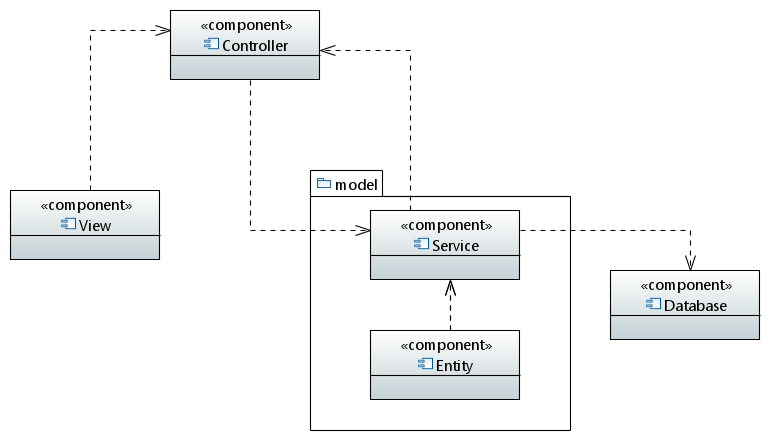

# Descrizione dell'Architettura

L'obiettivo del progetto è analizzare l'efficienza del personale e delle commesse attraverso la raccolta, l'elaborazione e la presentazione dei dati relativi ai task assegnati e completati. Il sistema si basa su un'architettura MVC (Model-View-Controller) con un database integrato condiviso tra tutte le istanze dell'applicazione. L'architettura è progettata per garantire flessibilità, manutenibilità e semplicità di utilizzo.

## 1. Architectural Views

### 1.1 Vista Logica

La vista logica descrive i principali moduli e la loro interazione. Il sistema si basa sui seguenti componenti principali:

### Model:
    Service:
    Contiene la logica applicativa e funzioni di business.
    Comunica con il database per salvare, aggiornare e recuperare i dati.
    Include classi come CommessaService, DipendenteService, ecc.
---------------------------------------------------------------------------
    Entity:
    Rappresenta i dati dell'applicazione e include entità come Dipendente, Commess, Task, ecc.Gestito tramite JPA (Java Persistence API) con EclipseLink per la persistenza dei dati.

### View:
    Interfaccia utente sviluppata con JavaFX e descritta tramite file FXML.
    Mostra i dati agli utenti e raccoglie input.

### Controller:
    Coordina le interazioni tra la View e il Model.
    Invoca i servizi per elaborare i dati e aggiorna la View.

Diagramma UML:

### 1.2 Vista dei Dati

La vista dei dati descrive la struttura del database e le relazioni principali tra le entità.

Entità Principali:

    Dipendente:
    Attributi: id, nome, cognome, reparto.
------------------
    Manager:    
    Attributi:
------------------  
    Commessa:
    Attributi:
------------------
    CommessaInstance:
    Attributi:
------------------
    Task:
    Attributi:
------------------
    TaskDipendente:
    Attributi: id, status, dipendente_id, task_id.
------------------
Diagramma ER (Entity-Relationship):

## 2. Vista Componenti e Connettori

La seguente vista mostra i componenti principali e i connettori utilizzati per la comunicazione.  

### Componenti Principali:

UI JavaFX:
Presenta dati agli utenti e riceve input tramite file FXML.

Controller:
Gestisce l'interazione tra la UI e il backend.

Service:
Contiene la logica applicativa principale e la persistenza dei dati.

Database Integrato:
Persistenza dei dati attraverso EclipseLink.

### Connettori:

FXML Loader: Carica i file FXML per creare l'interfaccia utente.

EclipseLink (JPA): Gestisce la comunicazione tra il servizio e il database.

Stile architetturale: Model-View-Controller (MVC)

## 3. Libreria Esterna con Maven

Per il progetto, sono state integrate diverse librerie con Maven:

Libreria Utilizzata: EclipseLink
Scopo: Gestione della persistenza dei dati nel database.
Configurazione Maven:
<dependency>
    <groupId>org.eclipse.persistence</groupId>
    <artifactId>javax.persistence</artifactId>
    <version>2.2.1</version>
</dependency>

Libreria Utilizzata: JUnit
Scopo: Test di unità e integrazione.
Configurazione Maven:
<dependency>
    <groupId>junit</groupId>
    <artifactId>junit</artifactId>
    <version>4.13.2</version> 
    <scope>test</scope>
</dependency>

Libreria Utilizzata: JavaFx
Scopo: Implentare la GUI.
Configurazione Maven:
<dependency>
    <groupId>org.openjfx</groupId>
	<artifactId>javafx-controls</artifactId>
    <version>23.0.1</version> 
</dependency>

# Design