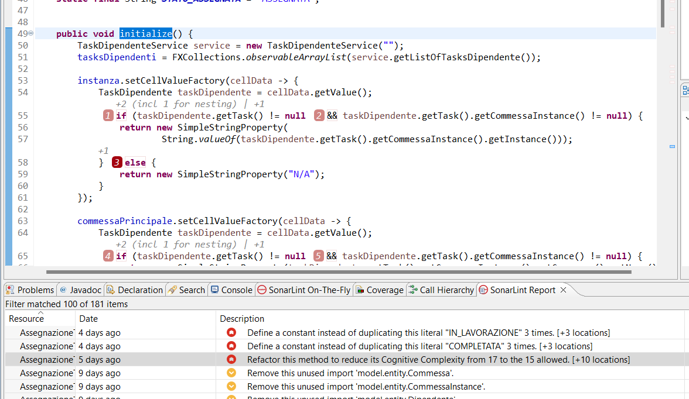
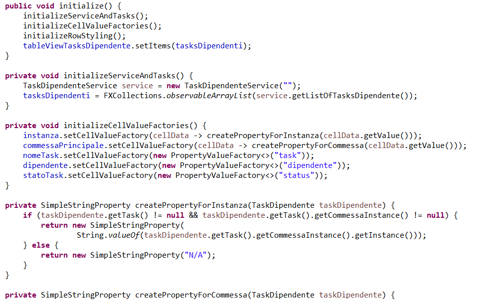

### MAINTENANCE
Per la fase di manutenzione abbiamo scelto di affidarci a sonarLint che ci garantisce un'analisi statica per la misura della
complessità dei nostri metodi e delle nostre classi.
In particolare abbiamo affrontato diverse scelte di refactor per poter ottenere metodi più puliti che ci permettano di essere anche più facilmente ripresi e modificati 
da parte di persone esterne.

## Refactor

### Metodo initialize (AssegnazioneTaskController.java)
Prima:

Sonarlint mostra come il metodo in questione abbia una Cognitive Complexity, una misura di complessità simile
alla complessità ciclomatica che però tiene anche conto della leggibilità del codice per un essere umano.
Abbiamo cosi effettuato un refactor e creato diversi metodi riutilizzabili per migliorare la leggibilità e diminuire
la complessità del metodo:

Dopo:

